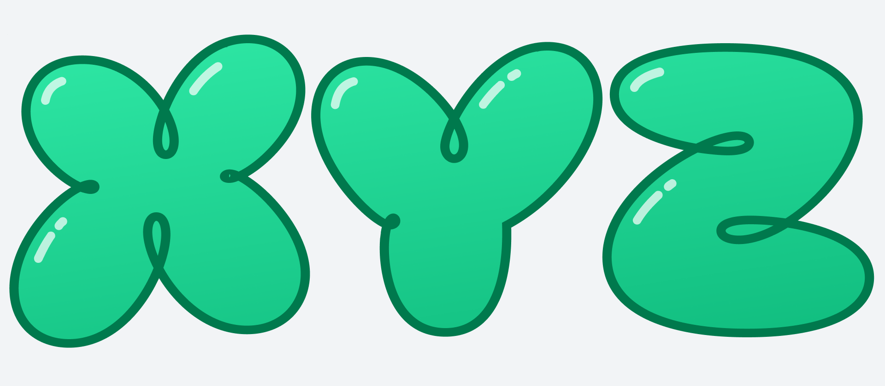

# Loopy

Loopy is a layered color typeface. You can combine styles with outline, highlight, shadow and fill, and set them in any colors you like.

Loopy captures a kind of bubbly lettershapes that are familiar from comics, stickers and street art, but rarely seen in serious typography, and rarely given the attention to detail that they deserve. 

Systematically irregular, with sometimes looping outlines, Loopy is happily ignorant about logic or typographic etiquette.

## Credits

Loopy was designed by me, Anders Wikström, in 2023 while working for the design agency Kid id (https://kidid.se/). 

Thanks for helpful feedback: 
* Iliana Nalbantska
* Many of my former colleagues at Kid id, including Fredrik Andersson, Elin Eskilsson, Jonas Bäckman, and Fredrik Smedenborn

